# Docker
## [Fuente](https://github.com/docker-library/docs/blob/master/postgres/README.md "GitHub: Fuente oficial")

# Ejemplo
Ejemplo practico de contenedores _Postgres_ en _Docker_

Ejecutaremos varios procesos para crear contenedores de Postgres en Docker

Para este taller es necesarios tener la imagen de Postgres instalada

**[Intalar imagen de Postgres](https://hub.docker.com/_/postgres "Ir al sitio de Docker Hub para Postgres")**
~~~Docker
docker pull postgres
~~~

## 1. Básico
  - Aquí nos encontramos con el primer error
  
    ~~~Docker
    docker run postgres
    ~~~
    
    Resultado

    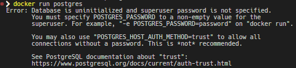

  - Para evitar esto la documentación nos dice que es necesario agregar una variable de entorno predeterminada 

    ~~~Docker
    docker run -e POSTGRES_PASSWORD=postgres postgres
    ~~~

    Resultado

    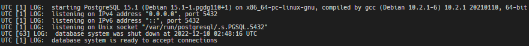

    Esta opción es la mas básica, podemos probar lo siguiente

    Listamos los contenedores que se estan corriendo
    ~~~Docker
    docker ps
    ~~~
    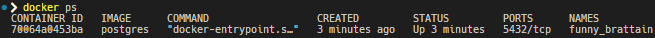
    Ejecutamos el _bash_ del contenedor que se creó
    ~~~Docker
    docker exec -it funny_brattain bash
    ~~~
    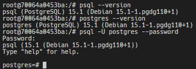
    Ya podemos manejar _Postgres_ en nuestro contenredor de _Docker_

## 2. Contenedor con puerto compartido 
- Ahora haremos uso de la etiqueta _-p_ para exponer el puerto del contenedor a nuestra máquina
  ~~~Docker
  docker run -e POSTGRES_PASSWORD=postgres -p 5432:5432 postgres
  ~~~

  Listemos los contenedores en ejecucion y comparemos los 2 casos
  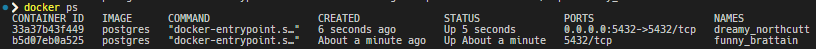

  Podemos ver que en la columna _PORTS_ la instancia de _Postgres_ que acabamos de crear tiene su puesrto expuesto a la maquina

  Esto lo podemos corroborar usando un manejador de bases de datos comno [DBeaver](https://dbeaver.io/download/ "Ir al sitio DBeaver y descargar")

  Creamos una nueva conección a bases de datos u elegimos _Postgres_

  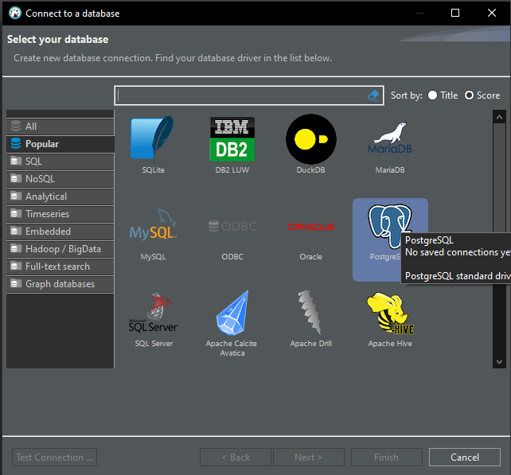

  Agregamos los datos de conección

  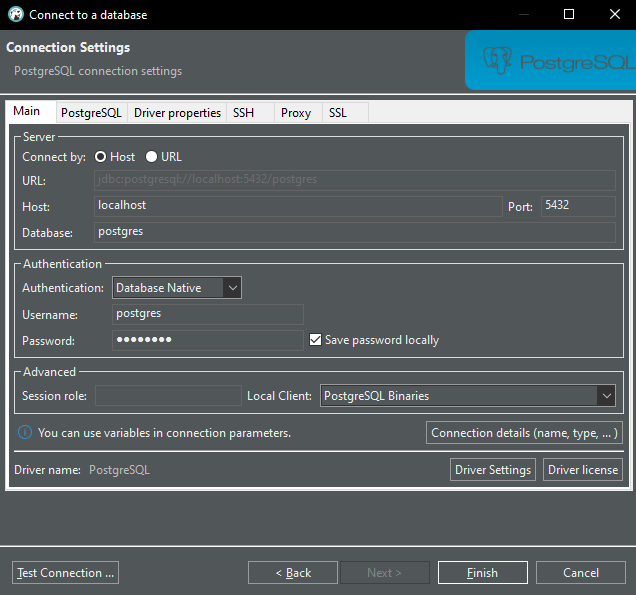

  Hacemos un _Test_ a la conección

  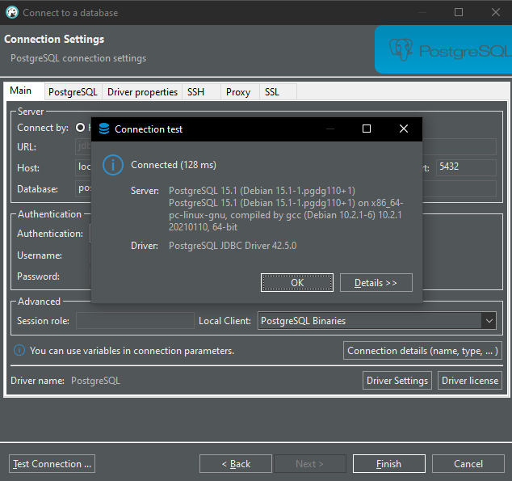

  Ya con esto necemos en menos de 10 minutos un motor de base de datos _Postgres_ corriendo en nuestra máquina 

  **¡ PERO PODEMOS MEJORARLO !**

## 3. Variables de entono para _Postgres_

Para nuestro contenedor ya sabemos que es requerida una variable de entorno que es `POSTGRES_PASSWORD`, esta variable no puede faltar al momento de instanciar contenedores de _Postgres_, pérp, hay mas variables que se pueden considerar

- **[POSTGRES_USER :](https://github.com/docker-library/docs/blob/master/postgres/README.md#postgres_user "Ir a la documentación de Postgres")** Esta variable de entorno opcional se usa junto con `POSTGRES_PASSWORD` para establecer un usuario y su contraseña. Esta variable creará el usuario especificado con alimentación de superusuario y una base de datos con el mismo nombre. Si no se especifica, entonces el usuario predeterminado de postgres será usado.

- **[POSTGRES_DB :](https://github.com/docker-library/docs/blob/master/postgres/README.md#postgres_db "Ir a la documentación de Postgres")** Esta variable de entorno opcional se puede usar para definir un nombre diferente para la base de datos predeterminada que se crea cuando se inicia la imagen por primera vez. Si no se especifica, entonces el valor de `POSTGRES_USER` será usado.

  Creemos un contenedor usando esta variables, usando como nombre de usuario _root_, contraseña _root_, y base de datos inicial _mydb_, exportando el puerto 5432 del contenedor al 3000 de la maquina
  ~~~Docker
  docker run --name docker-psql -e POSTGRES_USER=root -e POSTGRES_PASSWORD=root -e POSTGRES_DB=mydb -p 3000:5432 postgres
  ~~~
  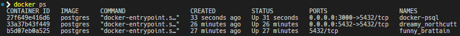

  Podemos ver como tenemos 3 contenedores de _Postgres_ ejecutandose en la maquina

  Conectemonos a esta ultima instancia

  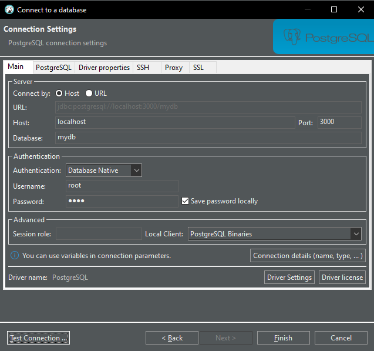

  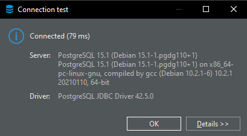

  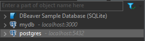

  **[Y que si te digo qu epuede ser mejor, ¡mira aquí!](https://github.com/AndresOsorio0710/docker/blob/docker/postgres/postgres/docker-compose.yml "docker-compose")**
